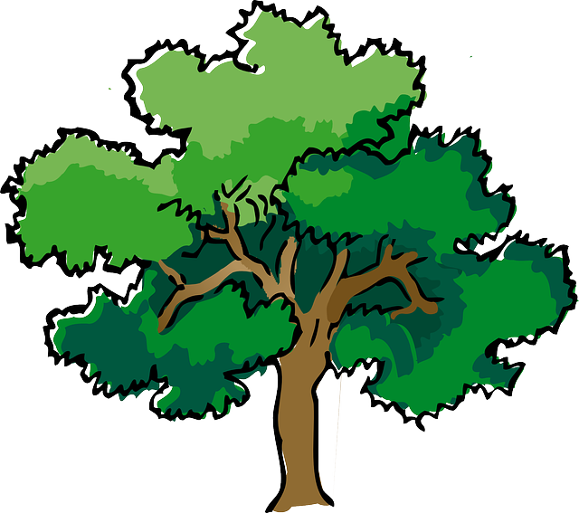

# Trees

picture of normal tree / stylized; then rotate it; transform to IT-tree

take stuff from tgi/algodat/...? introductionary lectures

# {{Optimization Function}}

# Game Tree

go through list of own moves, pick one, go through list of opp moves

[a game tree](https://www.ocf.berkeley.edu/~yosenl/extras/alphabeta/alphabeta.html)

# MinMax 

* @ tic-tac-toe 
    * compare to how humans would play / strategize
    * play one round with them

say how much points each board is worth

# Engine

* [Stockfish](https://github.com/official-stockfish/Stockfish)
* [Scorpio](https://github.com/dshawul/Scorpio)
* [Hydra](https://chessprogramming.wikispaces.com/Hydra)
* [Garry](https://github.com/upcrob/garry)
    * not sure if it can be given a miscelaneous chess problem
* [Hydra @ springer.com](http://link.springer.com/chapter/10.1007%2F978-3-540-30117-2_101)
* <http://www-h.eng.cam.ac.uk/help/tpl/languages/parallelprogramming.html>
* <http://goparallel.sourceforge.net/parallel-thinking-make-chess-more-human/>

# Presentation Tech

[impress.js](https://github.com/bartaz/impress.js)

in-place cross-fading: <http://stackoverflow.com/questions/17043356/how-to-fade-in-out-images-with-impress-js>

Omnia - The Raven
